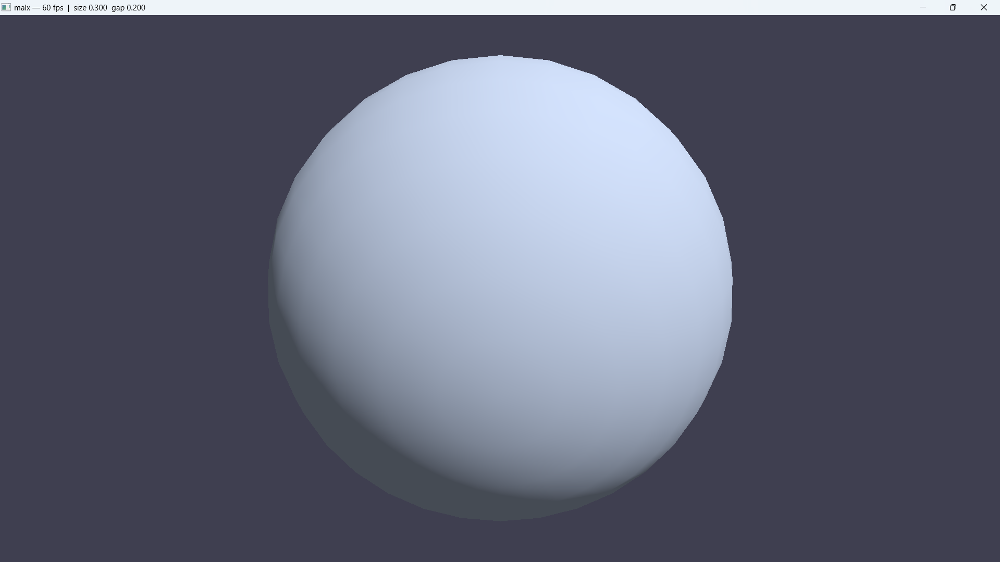

# Malachite

A real-time 3D renderer written in Rust, built on [wgpu](https://github.com/gfx-rs/wgpu).



## Features

- **Cross-platform GPU backend** — runs on Vulkan, Metal, DX12, and WebGPU without any code changes
- **GGX / Cook-Torrance PBR shading** — physically based BRDF with the GGX normal distribution function, Smith height-correlated masking-shadowing, and Schlick Fresnel; supports metallic/roughness workflow
- **Reinhard tone-mapping + gamma correction** — HDR radiance is tone-mapped and converted to sRGB before output so colours look correct on standard displays
- **Full PBR vertex format** — every vertex carries position, normal, UV, tangent, and bitangent (56 bytes, tightly packed), ready for normal and PBR texture sampling
- **Normal mapping ready** — TBN matrix is assembled per-vertex in the shader and interpolated to the fragment stage; plug in a normal map texture to activate it
- **Per-object model transform** — each object uploads its own model matrix and inverse-transpose normal matrix as a uniform, so non-uniform scaling transforms normals correctly
- **Perspective camera with orbit control** — view/projection matrix and eye position are uploaded every frame; Alt + drag to orbit, Alt + scroll to zoom
- **Procedural UV sphere** — generator produces correct tangent frames and seam-safe UV wrapping at any subdivision level
- **Sculpt-style brush cursor** — inner (size) and outer (hardness) rings rendered directly on the model surface using depth-tested 3D geometry; screen-space fallback when the cursor is off the model
- **Depth-correct rendering** — 32-bit depth buffer, counter-clockwise winding, back-face culling

## Project structure

```
malx/                   # rendering library (the crate users depend on)
  src/
    geometry/           # Vertex layout, Mesh upload, procedural primitives
    renderer/           # wgpu context, ScenePipeline, bind groups
    painter/            # BrushPipeline: 3D ring cursor + 2D screen-space fallback
    scene/              # Camera, SceneObject, Scene
  shaders/
    pbr_shader.wgsl     # GGX/Cook-Torrance vertex + fragment shader
app/                    # example application that drives malx
  src/
    main.rs             # window, event loop, camera tumble, brush state
```

## Building

```bash
cargo run
```

Requires Rust stable and a GPU with Vulkan, Metal, or DX12 support.

## Controls

| Input | Action |
|---|---|
| Alt + left-drag | Orbit camera |
| Alt + scroll | Zoom in / out |
| F + scroll | Change brush size (inner radius) |
| Shift + F + scroll | Change brush hardness (outer − inner gap) |
| Left-click on model | Print hit point and surface normal to stdout |

## Shader overview

The fragment shader implements the standard microfacet BRDF:

```
f(l, v) = (D · G · F) / (4 · dot(N,L) · dot(N,V))
```

- **D** — GGX (Trowbridge-Reitz) NDF: controls the sharpness of specular highlights
- **G** — Smith masking-shadowing with Schlick-GGX approximation: accounts for microfacets blocking each other
- **F** — Schlick Fresnel: reflectance increases at grazing angles; dielectrics start at ~4%, metals use their albedo colour

The scene currently uses two hardcoded directional lights (a warm key and a cool fill). Albedo, roughness, metallic, and AO are compile-time constants, ready to be replaced by texture samples.

## Roadmap

- PBR texture maps (albedo, normal, metallic/roughness, AO)
- Image-based lighting (environment map + irradiance/radiance precomputation)
- Mesh import (glTF / OBJ)
- Interactive sculpting (vertex displacement along the brush normal)

---

## Changelog

### 2026-03-23
- Replaced Blinn-Phong shading with a full GGX / Cook-Torrance BRDF
- Added Reinhard tone-mapping and gamma correction to the fragment shader
- Updated README to English with accurate feature descriptions and shader docs

### 2026-03-22
- Added tangents and bitangents to the vertex format (`Vertex`: position, normal, uv, tangent, bitangent — 56 bytes)
- Rewrote `pbr_shader.wgsl`: correct `vs_main` / `fs_main`, bind groups for `CameraUniform` and `ModelUniform`
- TBN matrix passed from vertex to fragment shader for normal mapping
- Per-object `ModelUniform` with model matrix and inverse-transpose for normals